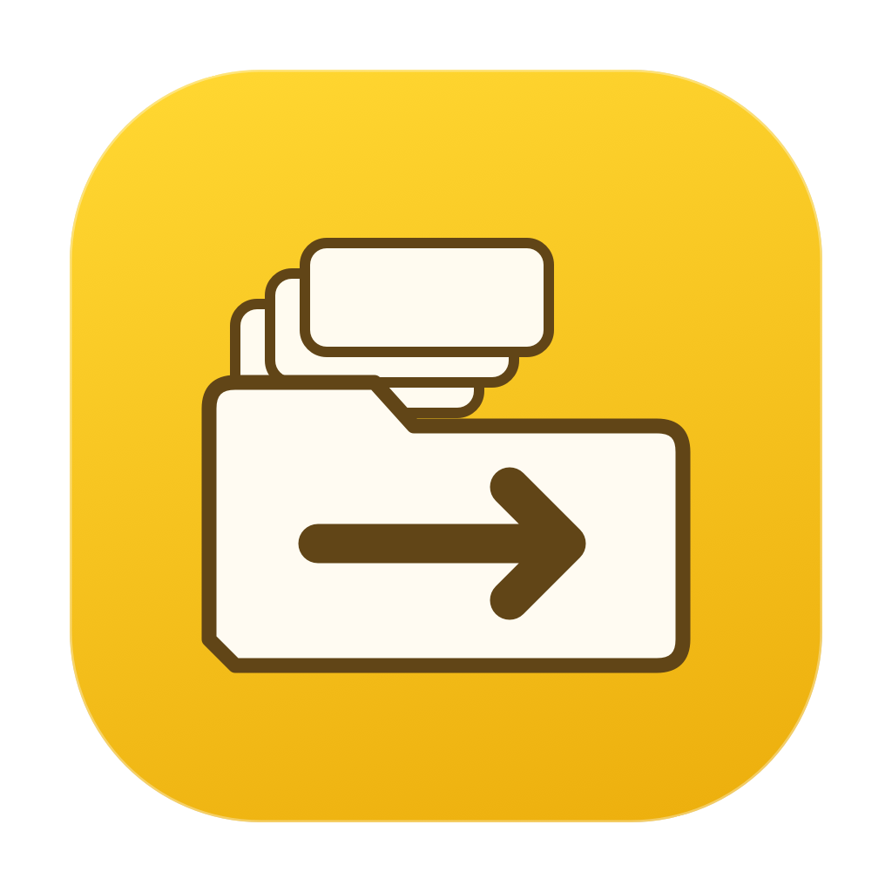

# FolderMover



[ダウンロード（1.0.0 build 5・試用版）](https://github.com/swwwitch/macos-apps/releases/tag/FolderMover-v1.0.0-build5)

画面の「コピー先」は移動先の指定欄です。本アプリは移動専用で、元ファイルを残すコピーではありません。

macOS 13以降 / Apple Silicon向けのネイティブアプリ。左右のカードでフォルダを選択し、移動元の直下にある項目を `/bin/mv -n` でまとめて移動します。

- フォルダ選択・ドラッグ＆ドロップ、フォルダ/隠し項目の包含設定。
- 同名項目はスキップ。既存ファイルを上書きせず、フォルダも統合しません。
- 最大128項目・約64KBの引数ごとに直接Processを起動。シェル、ワイルドカード、文字列コマンド連結は使いません。
- 進捗は直下の項目数で、バイト数や内部のファイル数ではありません。
- 停止は現在のバッチが終わってから。移動中の終了を保護します。
- ローカルJSONL履歴、4言語の表示とオフラインヘルプ。
- 表示設定でDropbox-sharedより前を省略（初期ON）。ポインタを重ねると完全なパスを表示。移動処理と履歴は完全なパスを保持。
- ログイン起動初期OFF、常駐初期ON。Dockから再表示。⌘W/⌘,/⌘Q。
- 起動ショートカットはmacOS「ショートカット」の「アプリを開く」経由でユーザーが設定します。アプリ内のキー録音・自動登録はありません。

## 開発

```sh
./build.sh
./test.sh
```

`build/FolderMover.app` に生成します。日本語/英語/簡体字中国語/韓国語リソースは `make-resources.py` から再生成できます。アイコンは `Assets/GenerateIcon.swift` から作成したオリジナルです。共有のAppHeader/AppSurface/LaunchPresenceSectionをビルド時に参照し、LoginAtLaunchControlとLaunchPolicyは既存実装から転用してローカライズしています。

## 制限・復元

自動Undoはありません。履歴の `moved` 項目だけをFinderで元に戻してください。逆方向への一括移動は既存の別ファイルを巻き込む可能性があります。同名は上書きせず保管してください。

別ボリュームへの移動はOSのmvによるコピー後削除です。容量不足や切断で失敗すると部分的なコピーが移動先に残り得ます。元の項目を保持して両方の状態を確認してください。実行中に他アプリで同じファイルを変更しないでください。失敗時は最初の非ゼロ終了バッチで停止します。

履歴は `~/Library/Application Support/FolderMover/History/`。ファイル内容は記録せず、復元用パスと処理結果を保存します。履歴は自動削除せずFinderで管理します。診断のstderrは最大4KBだけ画面へ表示します。外部通信はありません。

このビルドはローカル利用向けのad-hoc署名です。Developer ID署名・公証・更新配信先・更新検証鍵は未設定です。配布用の自動更新は稼働していません。

## 検証

2,000項目の一括移動、同名ファイル/ディレクトリ、空白・日本語・引用符・改行・シェル風の名前、壊れたシンボリックリンク、128件後の中断、移動元/先の置換検知を一時フォルダで検証。

ログインし直し、OS側のログイン項目解除、スリープ復帰、別ディスク/ネットワークディスク、容量不足、強制終了からの復元は未確認です。
